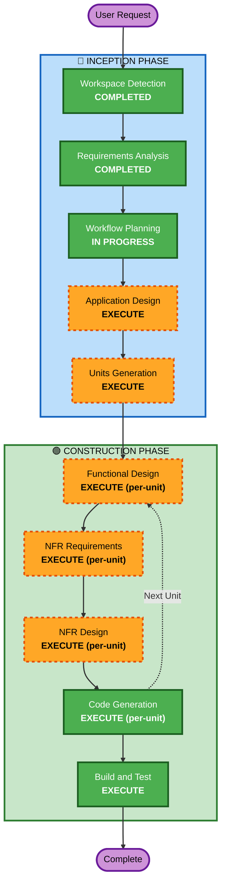

# Execution Plan

## Detailed Analysis Summary

### Change Impact Assessment
- **User-facing changes**: Yes — 고객용 주문 UI + 관리자 대시보드 신규 구축
- **Structural changes**: Yes — 전체 시스템 아키텍처 신규 설계 (FastAPI + Next.js + MySQL)
- **Data model changes**: Yes — 9개 핵심 엔티티 신규 설계
- **API changes**: Yes — REST API 전체 신규 설계 + SSE 엔드포인트
- **NFR impact**: Yes — JWT 인증, SSE 실시간 통신, bcrypt 해싱

### Risk Assessment
- **Risk Level**: Medium
- **Rollback Complexity**: Easy (Greenfield — 롤백 불필요)
- **Testing Complexity**: Moderate (다수 컴포넌트 간 통합 테스트 필요)

---

## Workflow Visualization



### Text Alternative
```
Phase 1: INCEPTION
  - Workspace Detection (COMPLETED)
  - Requirements Analysis (COMPLETED)
  - Workflow Planning (IN PROGRESS)
  - Application Design (EXECUTE)
  - Units Generation (EXECUTE)

Phase 2: CONSTRUCTION (per-unit loop)
  - Functional Design (EXECUTE, per-unit)
  - NFR Requirements (EXECUTE, per-unit)
  - NFR Design (EXECUTE, per-unit)
  - Code Generation (EXECUTE, per-unit)
  - Build and Test (EXECUTE, after all units)

Skipped Stages:
  - Reverse Engineering (Greenfield)
  - User Stories (Skipped by user)
  - Infrastructure Design (로컬/온프레미스 배포)
```

---

## Phases to Execute

### 🔵 INCEPTION PHASE
- [x] Workspace Detection (COMPLETED)
- [x] Requirements Analysis (COMPLETED)
- [x] Workflow Planning (IN PROGRESS)
- [ ] Application Design - **EXECUTE**
  - **Rationale**: 신규 프로젝트로 컴포넌트 식별, 서비스 레이어 설계, API 구조 정의 필요
- [ ] Units Generation - **EXECUTE**
  - **Rationale**: 복잡한 시스템으로 백엔드/프론트엔드 유닛 분해 및 의존성 정의 필요

### 🟢 CONSTRUCTION PHASE (per-unit)
- [ ] Functional Design - **EXECUTE**
  - **Rationale**: 데이터 모델 9개 엔티티, 세션 관리/주문 처리 비즈니스 로직 상세 설계 필요
- [ ] NFR Requirements - **EXECUTE**
  - **Rationale**: JWT 인증, SSE 실시간 통신, bcrypt 해싱 등 기술 선택 필요
- [ ] NFR Design - **EXECUTE**
  - **Rationale**: NFR 패턴을 컴포넌트에 통합하는 설계 필요
- [ ] Infrastructure Design - **SKIP**
  - **Rationale**: 로컬/온프레미스 배포로 클라우드 인프라 설계 불필요
- [ ] Code Generation - **EXECUTE** (ALWAYS)
  - **Rationale**: 구현 계획 수립 및 코드 생성
- [ ] Build and Test - **EXECUTE** (ALWAYS)
  - **Rationale**: 빌드 및 단위/통합 테스트 실행

### 🟡 OPERATIONS PHASE
- [ ] Operations - **PLACEHOLDER**

---

## Skipped Stages Summary

| Stage | Reason |
|-------|--------|
| Reverse Engineering | Greenfield 프로젝트 — 기존 코드 없음 |
| User Stories | 사용자가 건너뛰기 선택 |
| Infrastructure Design | 로컬/온프레미스 배포 — 클라우드 인프라 설계 불필요 |

---

## Success Criteria
- **Primary Goal**: 단일 매장용 테이블오더 MVP 완성
- **Key Deliverables**:
  - FastAPI 백엔드 (REST API + SSE)
  - Next.js 프론트엔드 (고객용 + 관리자용)
  - MySQL 데이터베이스 스키마
  - 단위 테스트 + 통합 테스트
- **Quality Gates**:
  - 모든 API 엔드포인트 동작 확인
  - SSE 실시간 주문 알림 2초 이내
  - JWT 인증 정상 동작
  - 단위/통합 테스트 통과
